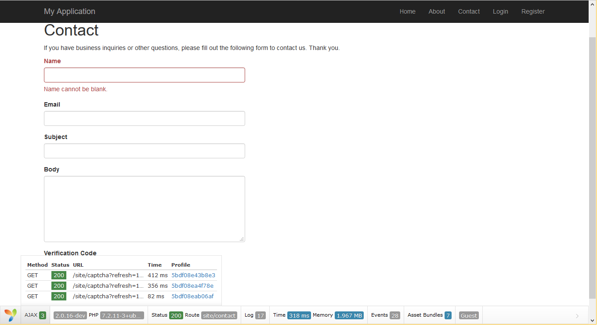

# yii2-debug

This is an improved version of the official [yii2-debug](https://github.com/yiisoft/yii2-debug) module.

The main benefit of this version is that it captures ajax calls and updates the debugbar accordingly.
Additionally, the main common panels are more compact.

Note: The official yii2-debug has since added its own ajax implementation. Their version is a hover div
instead of a dropdown. You can see the difference in images below

## Demo image:


## Official Yii2 Debug image (for reference):



## Installation:

Install package via composer ```"amnah/yii2-debug": "dev-master"```

## Usage:

```php
if (YII_ENV_DEV) {
    // configuration adjustments for 'dev' environment
    $config['bootstrap'][] = 'debug';
    $config['modules']['debug'] = [
        'class' => 'amnah\yii2\debug\Module',
        // uncomment and adjust the following to add your IP if you are not connecting from localhost.
        //'allowedIPs' => ['127.0.0.1', '::1'],
    ];
}
```